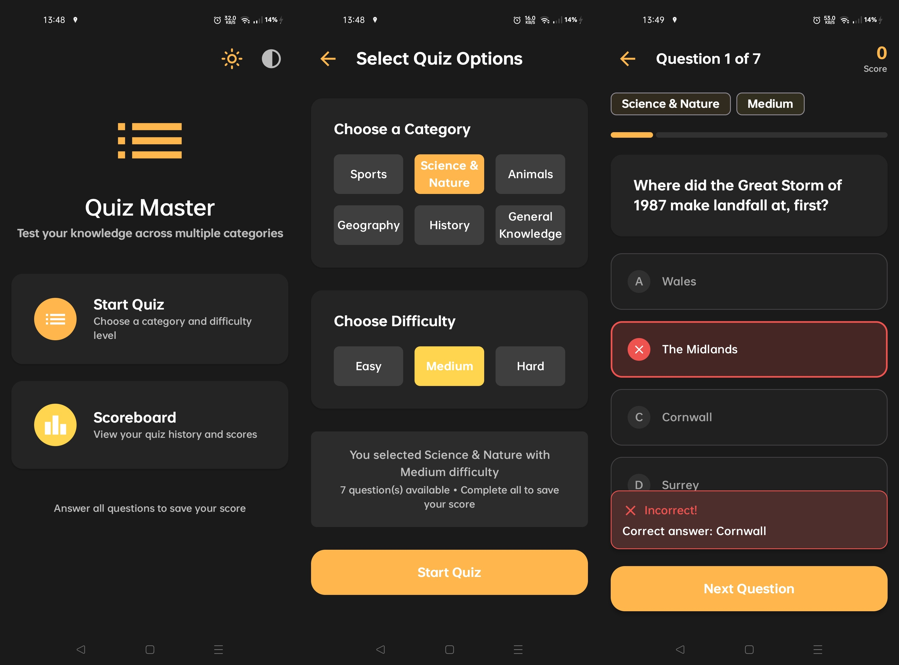
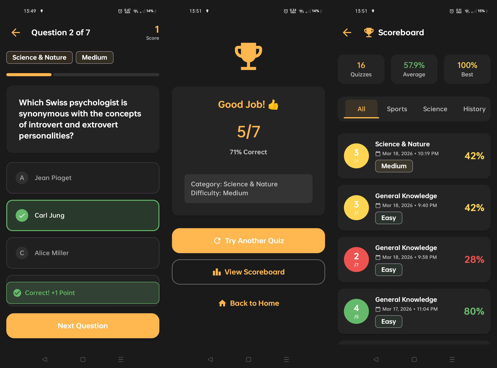

# Quiz Master
### PL
Aplikacja na system Android pozwalająca na grę w quizy, oparta na API OpenTDB. Wykorzystuje nowoczesne podejście do tworzenia interfejsu (Jetpack Compose), architekturę MVI oraz Clean Architecture. Zapisuje dane przy użyciu lokalnej bazy danych Room.
### EN
Android app for playing quizzes, based on the OpenTDB API. Built with a modern UI toolkit (Jetpack Compose), following MVI and Clean Architecture. Uses Room for local data persistence.
### Technologie/Technologies:
* Android
* Kotlin
* Jetpack Compose (Material Design 3)
* MVI + Clean Architecture
* Coroutines & Flow
* Hilt (Dependency Injection)
* Retrofit
* Room
* JUnit
* Gradle
* Git

### Installation [APK]

[APK]: https://github.com/Cutter72/quiz-master/releases/download/0.9.0/app-release-unsigned.apk

### Screenshots

